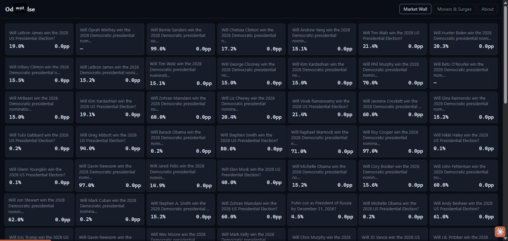
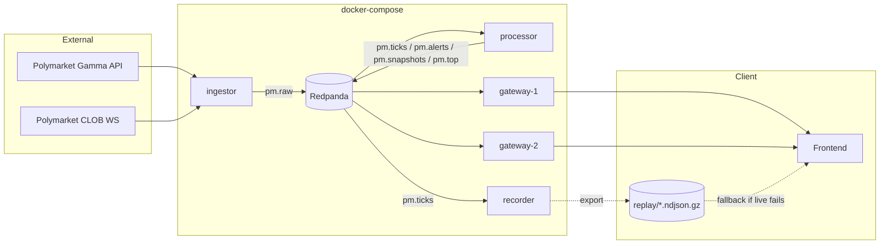

# OddsPulse

Realtime Polymarket prediction-market prices flow through a Redpanda (Kafka
API) pipeline into a Go WebSocket gateway that fans them out live to a
browser Market Wall, Surge Feed, and Top Movers panel.



## Run it locally in one command

```sh
make up
```

That's `docker compose -f deploy/docker-compose.yml up -d` under the hood -
if `make` isn't installed (e.g. plain Windows), run that command directly.
Either way it builds every service's image from source and starts the full
real stack: Redpanda, a topic-init job, `ingestor` (connects to the real
Polymarket Gamma API + WebSocket - no API key needed, no synthetic mode
required to see it work), `processor`, two `gateway` instances, and
`recorder`. **Verified for this phase**: run from a clean `docker ps`, it
brought up all 6 services (`redpanda` healthy, the rest running) and real
ticks were flowing end to end - confirmed via `curl localhost:8081/readyz`
(200) and `curl localhost:9091/metrics | grep ingestor_events_total`
climbing - within about 30 seconds on this dev machine.

Then, for the frontend:

```sh
cd web && npm install && npm run dev
```

and open `http://localhost:5173/oddspulse/`. `make down` tears the backend
back down.

Want load instead of (or alongside) real Polymarket data? `cmd/loadgen-producer`
generates a configurable synthetic feed and `cmd/loadgen-clients` opens many
WS connections to benchmark the gateway - see `loadtest/scenarios.md` for
exact invocations.

> **Known gap, found live while preparing this README:** the two gateway
> instances load `pm.markets` metadata once at their own startup
> (`cmd/gateway/bootstrap.go`), racing the ingestor's own first market-
> discovery fetch. If the gateways finish their (empty) bootstrap before the
> ingestor produces its first `pm.markets` batch, the Market Wall stays on
> "Waiting for market metadata..." until the gateways are restarted. Worth
> knowing if you bring the stack up and the wall looks empty - `docker
> compose -f deploy/docker-compose.yml restart gateway-1 gateway-2` after the
> ingestor's first refresh fixes it. See "What I'd do next" below.

## Architecture



A larger version with the full rationale (why each service is split out the
way it is) lives in [`docs/design-plan.md` §3](docs/design-plan.md#3-system-architecture);
the same diagram (SVG, hand-adapted for the frontend's theme) also renders on
the site's own **About** page (`web/src/pages/About.svelte`) rather than
being drawn a third time here.

- **ingestor**: connects to Polymarket, shards WS connections across assets, reconnects with backoff, produces normalized events.
- **processor**: computes change/volatility/surges per asset, at-least-once (ADR-004).
- **gateway**: fans out to WebSocket clients; each instance is a broadcast Kafka consumer (ADR-002), with pre-encoding + batching/conflation (ADR-003) and bounded-queue slow-client eviction.
- **recorder** + **Replay mode**: the frontend always shows moving data, live or replayed (ADR-005).

## Benchmark summary

Full methodology, every table, pprof flame-graph findings, and stated
caveats: **[`docs/benchmark.md`](docs/benchmark.md)** (how to reproduce:
[`loadtest/scenarios.md`](loadtest/scenarios.md)). Measured on this dev
machine (Ryzen 7 7435HS, 8c/16t, ~24GB RAM, Windows 11 + Docker Desktop/WSL2)
- explicitly **not** the design's 2 vCPU/4GB VPS target; every number below
is real, not estimated.

| Design target (§2) | Measured | Met? |
|---|---|---|
| Ingest ≥ 50,000 events/s | ~50,000 sustained, flat latency; unbounded queueing by 60,000 | Met, no headroom |
| ≥ 10,000 concurrent WS clients/gateway | 20,000 sustained at 100% established, 26,116 before handshake timeouts | Met, 2x over |
| e2e latency p50 < 20ms / p99 < 100ms | p50 7-176ms (scale-dependent) / p99 66ms-6.3s | p50 sometimes met; **p99 not met at ≥10,000 clients** |
| Memory/connection < 30 KB | ~9-11 KB @ 10,000; ~25-34 KB @ 20,000 | Met at 10,000; borderline at 20,000 |
| Recovery after Polymarket WS drop < 5s | ~2s | Met (see S5 caveat on `restart: unless-stopped` below) |

Also measured: pre-encoding is ~2-2.5x cheaper in CPU than a naive per-client
re-marshal; a 50ms flush interval beat the original 100ms default on every
axis at benchmarked scale (now the default, [ADR-003](docs/adr/003-batching-conflation-interval.md));
horizontal scaling (1 → 2 gateway instances) roughly halved p50/p99 latency
for the same 20,000 total clients, though aggregate throughput only grew
~9%; a heap profile found the gateway's tick cache was pinning entire Kafka
fetch buffers alive (fixed this phase, see below).

## This phase's bug fixes

Three real bugs Phase 6's profiling/load-testing surfaced, fixed and tested
this phase:

1. **`internal/hub/cache.go`'s tick cache retained whole Kafka fetch
   buffers.** `setTick` stored a `kgo.Record.Value` slice as-is; since
   franz-go can share one decompressed batch's backing array across every
   record in it, a single long-lived cache entry could pin the entire batch.
   Fixed by copying the bytes before caching (`cache_test.go` proves the
   cached copy is unaffected by mutating the source buffer afterward - this
   was also independently confirmed by a Phase 6 heap profile, see
   `docs/benchmark.md`'s pprof section).
2. **`gateway_slow_client_evictions_total` missed the write-timeout
   disconnect path.** Only the queue-still-full-after-N-flushes path
   incremented it; a connection that failed/timed out mid-write disconnected
   silently, uncounted (found in S4 testing - the metric read `0` while
   slow clients were, correctly, still being dropped). Both disconnect paths
   now route through one `Hub.evict`, with `RemoveClient` reporting whether
   it actually removed anything so a client caught by both paths at once is
   never double-counted (`TestWriteErrorEvictsAndCountsMetric`).
3. **`processor_consume_lag` was reset, not accumulated, every poll.** It
   `Set()` the gauge from only the partitions that had records in that one
   batch, silently dropping whatever the other partitions had last reported
   - it read near-0 in `docs/benchmark.md`'s S1 even while real latency was
   climbing past 3 seconds under overload. Replaced with a per-partition map
   persisted across polls and always reported as its full sum
   (`TestPartitionLagAccumulatesAcrossPolls`).

## Design decisions

Short, one-page ADRs for every decision with lasting consequences:
[`docs/adr/`](docs/adr/README.md) - Redpanda over Kafka, the gateway's
broadcast consumer-group pattern, the batching/conflation interval (revised
with real Phase 6 data), at-least-once delivery, GitHub Pages + replay
fallback, and the `coder/websocket`/`caarlos0/env` dependency choices.

## What I'd do next

Honest, drawn from the open items this project's own phases actually found
(not padded):

- **Gateway `pm.markets` cold-start race** (see the callout above): the
  one-shot bootstrap read can finish before the ingestor's first market
  discovery produces anything, and unlike `pm.snapshots`/`pm.ticks`,
  `pm.markets` is never re-read afterward. A small fix (keep consuming
  `pm.markets` continuously after bootstrap, the way `cmd/processor` already
  does for the same topic) would close this.
- **`cmd/processor/bootstrap.go` still uses the older, weaker idle-timeout
  heuristic** (`consumeUntilIdle`, 3 idle 500ms polls) that `cmd/gateway`'s
  own bootstrap moved away from after finding it unreliable on a
  continuously-written compacted topic (`cmd/gateway/bootstrap.go`'s
  `consumeUpToEnd` uses a real `kadm.ListEndOffsets` target instead). The
  processor's version was never upgraded to match.
- **p99 latency at scale**: not met at any tested client count ≥ 10,000
  (§2's <100ms target). The CPU profile traces this to the syscall cost of
  one `write(2)` per client per flush cycle at high connection counts, not
  to anything algorithmic - reducing it further means fewer sockets per
  process (more horizontal scaling) or a different I/O model, not more
  application-level tuning.
- **`restart: unless-stopped` didn't auto-restart** any killed container
  within the observation window on this Docker Desktop/Windows setup (S5) -
  needs re-verification on the real target Linux VPS before relying on it
  in production.
- **`GW_FLUSH_MS=50`** was only validated at a 2,000-client benchmark scale,
  not re-tested at the 10,000-20,000-client range used elsewhere in the
  benchmark - worth re-confirming it's still the better default there.
- **JSON vs. binary encoding** (Protobuf/MessagePack): explicitly optional
  per the design plan, not attempted - the honest reason is time budget, not
  that it wouldn't matter at higher scale.
- S3 (hot market) and the naive-remarshal comparison were only measured at
  moderate scale (10,000 and 2,000 clients respectively); re-running both at
  ~20,000 would sharpen both findings.

### Stretch goals - not attempted, and why

`docs/design-plan.md` §15 lists four optional stretch goals. None were
attempted; each was a deliberate scope call, not an oversight:

- **A second data source + cross-market odds difference** - would need a
  second real-time integration built and normalized to the same `RawEvent`
  schema; a meaningful addition, but a whole extra ingestion surface, not a
  Phase 7 polish item.
- **Correlation between markets** - a real analytics feature (would need its
  own windowed computation in the processor and a new UI panel), not a small
  add-on.
- **Kubernetes (k3s) + HPA instead of compose** - the whole design is scoped
  to a single small VPS via docker-compose (§13); standing up k3s would
  change the deployment target the rest of the project was built and
  benchmarked against, not extend it.
- **SSE fallback for networks that block WebSocket** - the project already
  has a fallback story for "no live connection" (Replay mode, ADR-005);
  adding a second live-transport implementation alongside WebSocket was
  judged lower value than polishing the one that exists.

## Disclaimer

OddsPulse is a personal engineering project. It is not investment advice,
and it is not affiliated with, endorsed by, or sponsored by Polymarket. (The
same disclaimer is on the site's About page.)

## Documentation

- [Design plan](docs/design-plan.md)
- [Benchmark report](docs/benchmark.md) / [load-test methodology](loadtest/scenarios.md)
- [Architecture decision records](docs/adr/README.md)
- [Polymarket API notes](docs/polymarket-notes.md)
- [Deployment checklist](docs/deployment.md)
