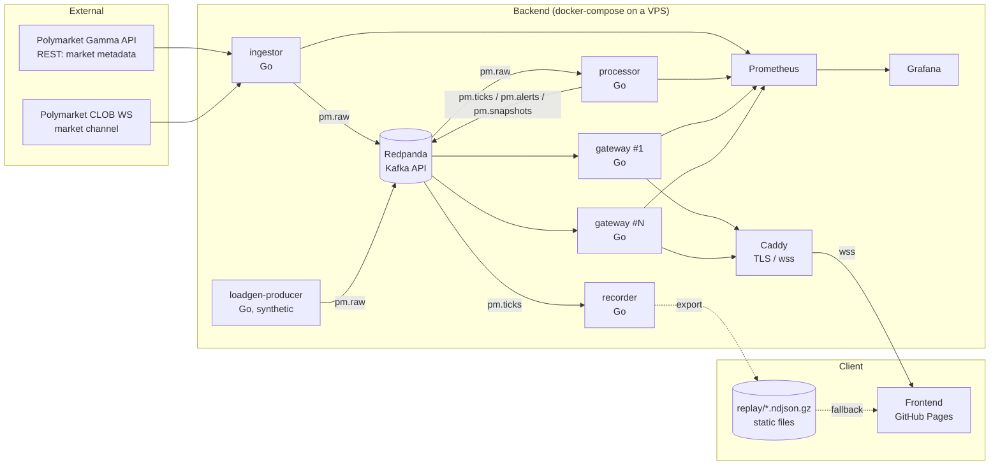

# OddsPulse — Realtime Prediction Market Tracker

> Track the "price of the future" from Polymarket in realtime with Go + Kafka (Redpanda) + WebSocket
> Architecture and development plan (v1.0 — Sep 2026)

---

## Table of Contents

1. [Project Overview](#1-project-overview)
2. [Goals and Metrics](#2-goals-and-metrics)
3. [System Architecture](#3-system-architecture)
4. [Service Details](#4-service-details)
5. [Kafka Topics and Data Model](#5-kafka-topics-and-data-model)
6. [WebSocket Protocol (Gateway ↔ Browser)](#6-websocket-protocol-gateway--browser)
7. [Frontend](#7-frontend)
8. [Replay Mode](#8-replay-mode)
9. [Load Testing and Benchmarks](#9-load-testing-and-benchmarks)
10. [Observability](#10-observability)
11. [Repository Layout](#11-repository-layout)
12. [Tech Stack](#12-tech-stack)
13. [Deployment](#13-deployment)
14. [CI/CD](#14-cicd)
15. [Development Plan by Phase](#15-development-plan-by-phase)
16. [Risks and Mitigations](#16-risks-and-mitigations)
17. [Portfolio Checklist](#17-portfolio-checklist)

---

## 1. Project Overview

**Idea:** Polymarket is a market where "outcomes of future events" are traded. Each outcome is priced between 0 and 1 USD, which can be read as the probability the market assigns to it (e.g. 0.63 = 63%). Prices move constantly with news and trading.

**What OddsPulse does**

- Receives price streams from the Polymarket WebSocket for thousands of markets at once
- Passes them through a Kafka pipeline to normalize, compute statistics (change, volatility) and detect "odds surges"
- Fans out to a large number of viewers through a horizontally scalable WebSocket gateway
- The frontend shows a live Market Wall (heatmap), per-market charts, a Surge Feed and System Stats
- Includes a **Replay mode** so the GitHub Pages site always works even when the backend is down

**Selling points for a portfolio**

| What it shows | Evidence |
|---|---|
| Event-driven architecture | Kafka topics with clearly separated responsibilities, compacted topic for snapshots |
| High-throughput fan-out | Benchmark: concurrent WS clients, msgs/s, p99 latency |
| Resilience | Reconnect/backoff, backpressure, slow-client eviction, replay fallback |
| Observability | Prometheus + Grafana dashboard, live stats on the web page |
| Production thinking | TLS, origin check, client-side rate limit, graceful shutdown |

---

## 2. Goals and Metrics

### Functional

- Track at least 1,000 active market outcomes at the same time
- Users can subscribe to individual markets, categories or "Top movers"
- Alert when a price changes by ≥ X percentage points within N seconds (configurable)
- Users who just connected get the latest snapshot immediately, without waiting for the next tick

### Non-functional (targets to be proven by benchmarks)

| Metric | Target (on a 2 vCPU / 4 GB machine) |
|---|---|
| Ingest throughput (synthetic) | ≥ 50,000 events/s |
| Concurrent WS clients per gateway | ≥ 10,000 |
| End-to-end latency (ingestor receive → gateway send) | p50 < 20 ms, p99 < 100 ms |
| Memory per WS connection | < 30 KB |
| Recovery after the Polymarket WS drops | < 5 s |

> These numbers are "targets". They must be measured for real and reported as measured, whether or not they meet the targets.

---

## 3. System Architecture



### Data flow in brief

1. The **ingestor** fetches the market list from the Gamma API, then opens several WebSocket connections (shards) to Polymarket, receives raw events → light normalization → produces to `pm.raw`
2. The **processor** consumes `pm.raw` → keeps per-market state in memory → computes change/volatility → produces `pm.ticks` (ready-to-use data), `pm.alerts` (surges) and `pm.snapshots` (compacted, latest state)
3. Each **gateway** consumes every partition of `pm.ticks`/`pm.alerts` (one consumer group per instance = broadcast) → distributes to clients according to their subscriptions with batching/conflation
4. The **recorder** stores `pm.ticks` as hourly NDJSON files for replay
5. The **Frontend** tries to connect over `wss://`; if that fails within 3 seconds it automatically switches to Replay mode

### Why split the services this way

- **ingestor separate from processor**: the ingestor has a single job — "never miss data". If the processor is slow or restarts, the data stays in Kafka and is not lost
- **processor separate from gateway**: computation is done once and does not need to be repeated in every gateway
- **gateway is (almost) stateless**: scales horizontally by adding instances; the state it needs can be restored from the compacted topic
- **loadgen-producer writes to the same `pm.raw` topic**: proves the throughput of the whole pipeline without depending on real data volume

---

## 4. Service Details

### 4.1 ingestor

**Responsibility:** connect Polymarket → Kafka durably

**Market discovery**
- Call the Gamma API (`GET /markets?active=true&closed=false`, paginated) every 5 minutes
- Store metadata: `market_id`, `question`, `slug`, `category/tags`, `end_date`, `volume`, `clob_token_ids` (the asset IDs of each outcome)
- Pick the top N markets by volume (configurable, e.g. 1,000 outcomes)
- Produce metadata to `pm.markets` (compacted) so other services and the frontend can use it

**WebSocket sharding**
- Split asset IDs into groups (e.g. 200 per connection) → open several connections in parallel
- When the market list changes: diff the old set against the new one and subscribe/unsubscribe only the difference (or reconnect the affected shards)
- Heartbeat: send pings at the interval Polymarket specifies; if no data arrives beyond the timeout, treat the connection as dropped
- Reconnect: exponential backoff + jitter (500 ms → max 30 s)

**Normalization**
- Convert raw events (e.g. book, price change, last trade) into a single `RawEvent` schema (see §5)
- Add `recv_ts` (the time the ingestor received it) for measuring latency
- Key = `asset_id` so events of the same outcome land in the same partition → preserves ordering

**Kafka producer**
- `acks=all` (on a single-node Redpanda 1 is enough, but set it for the future), ~5 ms linger batching, `zstd` or `lz4` compression
- If Kafka is unavailable: buffer in memory with a bounded size → once exceeded, drop and count a metric (never block the WS read)

> ⚠️ The message format and endpoint must be checked against Polymarket's official documentation (docs.polymarket.com) at the start of Phase 1 because the API may change. Write the parser as a single package so it can be fixed in one place

### 4.2 processor

**Responsibility:** turn raw events into data the UI can use immediately

**Per-asset state (in-memory)**
```go
type AssetState struct {
    AssetID   string
    MarketID  string
    Last      float64       // latest price (mid or last trade)
    BestBid   float64
    BestAsk   float64
    Open24h   float64
    Ring      *RingBuffer   // price at 1 point per second, last 15 minutes
    UpdatedAt time.Time
}
```

**Computations**
- `chg_1m`, `chg_5m`, `chg_1h` (percentage points)
- `vol_5m` = standard deviation of the 5-minute log-return
- Surge detection: `|Δp| ≥ threshold` within a window (e.g. ≥ 5 pp in 60 s) + a 2-minute per-asset cooldown to avoid duplicate alerts
- Top movers: sort by `|chg_5m|` every 1 s → produce the top 50 list

**Output**
- `pm.ticks`: every event where the price actually changed (deduped if the price is unchanged)
- `pm.alerts`: surge events
- `pm.snapshots`: latest state per asset (compacted, key = asset_id), updated at most once per second per asset
- `pm.top`: top movers list

**Scaling:** a single consumer group (`processor`); instances can be added up to the number of partitions — state is naturally split by partition because key = asset_id. On rebalance, load state from `pm.snapshots` (the ring buffer may start fresh, which is acceptable for a demo)

**Delivery semantics:** at-least-once (commit offsets after a successful produce). Clients can be idempotent because seq/ts are sent along

### 4.3 gateway

**Responsibility:** fan out data to a large number of WebSocket clients — this is the heart of the benchmark

**Kafka consumption**
- Each instance uses a **unique** consumer group (e.g. `gateway-<hostname>`) → every instance receives every partition (broadcast)
- Start reading `pm.ticks` from latest; read `pm.snapshots` and `pm.markets` from earliest to build a cache at startup

**Internal structure**
```
Kafka consumer ──► Router ──► Topic index (asset_id → set of subscribers)
                                   │
                                   ▼
                  per-client outbound queue (bounded channel)
                                   │
                                   ▼
                       writer goroutine per client ──► WS frame
```

- **Subscription index:** `map[channelKey]*subscriberSet` protected by a sharded RWMutex (e.g. 64 shards by hash) to reduce lock contention
- **Batching + conflation:** each client has a buffer that is flushed every 100 ms (configurable). If the same asset has several ticks in one round, only the latest value is sent → drastically reduces the number of frames when data is frequent
- **Backpressure:** the outbound queue has a bounded size. If it stays full for more than N consecutive rounds → drop the client (slow consumer) and increment the metric `gateway_slow_client_evictions_total`
- **Snapshot on subscribe:** when a client subscribes to an asset, send a snapshot from the cache immediately
- **Pre-encoding:** encode a tick's JSON once and share the bytes with every client subscribed to it (no re-encoding per client) — a key optimization that should be measured before/after
- **Security:** check the `Origin` header (allow only the GitHub Pages domain and localhost), limit subscriptions per client (e.g. 500), rate limit messages from clients, max message size 4 KB
- **Graceful shutdown:** on SIGTERM, send a close frame with code 1012 (service restart) so clients reconnect to another instance

**Endpoints**
- `GET /ws` — WebSocket
- `GET /healthz`, `GET /readyz` — readiness = consumer caught up and cache ready
- `GET /metrics` — Prometheus

### 4.4 recorder

- Consume `pm.ticks` + `pm.alerts` → write `data/replay/YYYY-MM-DD/HH.ndjson.gz`
- The `make replay-export` script picks an "interesting" window (lots of surges), trims it to ~30–60 minutes with a target size < 5 MB, then copies it to `web/public/replay/` together with `manifest.json`

### 4.5 loadgen (two parts)

1. **loadgen-producer** — generates synthetic `RawEvent`s into `pm.raw` using a per-asset random walk, with an adjustable rate (`--rate=50000 --assets=5000`) and a flag to inject random surges to test alerts
2. **loadgen-clients** — a Go program that opens many WS connections (`--conns=10000 --subs-per-conn=20`) and measures client-side latency from `recv_ts` in the payload (run on the same network to reduce clock-skew problems). k6 is an optional extra for easier-to-read reports

---

## 5. Kafka Topics and Data Model

### Topics

| Topic | Key | Partitions | Retention / Policy | Producer → Consumer |
|---|---|---|---|---|
| `pm.markets` | market_id | 3 | compact | ingestor → processor, gateway |
| `pm.raw` | asset_id | 12 | delete, 6 h | ingestor, loadgen → processor |
| `pm.ticks` | asset_id | 12 | delete, 24 h | processor → gateway, recorder |
| `pm.snapshots` | asset_id | 12 | compact | processor → gateway (bootstrap) |
| `pm.alerts` | asset_id | 3 | delete, 7 d | processor → gateway, recorder |
| `pm.top` | "top" | 1 | delete, 1 h | processor → gateway |

> 12 partitions lets the processor scale up to 12 instances; on a single machine not all of them are needed, but they are hard to change later so they are provisioned up front.

### Schemas (JSON, with a `v` field for versioning)

**RawEvent** (`pm.raw`)
```json
{
  "v": 1,
  "src": "polymarket",
  "kind": "quote",
  "asset_id": "7184...",
  "market_id": "0xabc...",
  "price": 0.634,
  "best_bid": 0.63,
  "best_ask": 0.638,
  "size": 120.5,
  "side": "BUY",
  "src_ts": 1790000000123,
  "recv_ts": 1790000000140
}
```
`kind`: `quote` | `trade` | `book`

**Tick** (`pm.ticks`)
```json
{
  "v": 1,
  "a": "7184...",
  "m": "0xabc...",
  "p": 0.634,
  "b": 0.63,
  "k": 0.638,
  "c1m": 1.2,
  "c5m": -3.4,
  "vol": 0.021,
  "seq": 88123,
  "rts": 1790000000140,
  "pts": 1790000000152
}
```
Short keys are used because the payload is sent hundreds of thousands of times — the schema documentation must explain them clearly

**Alert** (`pm.alerts`)
```json
{
  "v": 1,
  "a": "7184...",
  "m": "0xabc...",
  "q": "Will X happen by Dec 31?",
  "outcome": "Yes",
  "from": 0.41,
  "to": 0.58,
  "window_s": 60,
  "ts": 1790000000152
}
```

### Go model
- All schemas live in `internal/model` and are shared by every service
- Phase 6 (optional): add a binary encoding (Protobuf or MessagePack) and benchmark it against JSON — good material for the README

---

## 6. WebSocket Protocol (Gateway ↔ Browser)

### Client → Server
```json
{ "op": "sub",   "ch": "asset",  "ids": ["7184...", "9921..."] }
{ "op": "unsub", "ch": "asset",  "ids": ["7184..."] }
{ "op": "sub",   "ch": "top" }
{ "op": "sub",   "ch": "alerts" }
{ "op": "sub",   "ch": "sys" }
{ "op": "ping",  "t": 1790000000000 }
```

### Server → Client
```json
{ "t": "hello", "server": "gw-1", "proto": 1 }
{ "t": "snap",  "d": [ { ...Tick } ] }
{ "t": "ticks", "d": [ { ...Tick }, { ...Tick } ] }
{ "t": "top",   "d": [ { "a": "...", "c5m": 8.1 } ] }
{ "t": "alert", "d": { ...Alert } }
{ "t": "sys",   "d": { "clients": 10234, "in_eps": 41200, "out_mps": 1.9e6, "p99_ms": 38 } }
{ "t": "pong",  "t0": 1790000000000, "srv": 1790000000004 }
{ "t": "err",   "code": "too_many_subs", "msg": "limit 500" }
```

### Rules
- Data is always batched (`ticks` is an array), flushed every 100 ms
- Clients reconnect with exponential backoff + jitter and automatically re-subscribe to everything
- The server sends a WS ping every 30 s and closes the connection if there is no pong within 60 s
- The `sys` channel is sent every 1 s — used for the System Stats panel on the web page

---

## 7. Frontend

### Stack
- **Vite + TypeScript + Svelte** (small bundle, good reactivity for frequent data) — React can be used instead if preferred
- **Charts:** TradingView Lightweight Charts (open source) for price charts
- **Styling:** CSS variables + dark theme (fits the trading-terminal vibe)

### Screens

| Page / Panel | Details |
|---|---|
| **Market Wall** | Grid of the top 100 markets as tiles colored by `c5m` (green/red, intensity by magnitude), flashing on each tick |
| **Market Detail** | Question, outcomes, live price (probability) chart, bid/ask, change 1m/5m/1h |
| **Surge Feed** | List of the latest alerts, e.g. "Yes: 41% → 58% in 60 seconds" |
| **Top Movers** | Table sorted by change, updated every second |
| **System Stats** | Clients online, events/s in, messages/s out, p99 latency, mode (LIVE / REPLAY) |
| **About / Architecture** | Diagram + GitHub link + benchmark results |

### Browser-side performance
- Ticks are received into a buffer and rendered with `requestAnimationFrame` (max 60 fps) — do not render on every message
- The Market Wall uses CSS transforms/class toggles instead of creating new DOM
- Chart data is stored in a bounded ring buffer

### Data source abstraction
```ts
interface FeedSource {
  connect(): Promise<void>;
  subscribe(ch: Channel, ids?: string[]): void;
  unsubscribe(ch: Channel, ids?: string[]): void;
  on(event: 'ticks' | 'alert' | 'top' | 'sys' | 'status', cb: Handler): void;
}
class LiveSource implements FeedSource { /* WebSocket */ }
class ReplaySource implements FeedSource { /* reads ndjson.gz files */ }
```
The UI does not know where the data comes from → modes can be switched without changing any component

### Config
- `VITE_WS_URL=wss://api.<your-domain>/ws` set via GitHub Actions
- `base` in `vite.config.ts` is set to `/<repo-name>/` for GitHub Pages

---

## 8. Replay Mode

**Why it matters:** someone may open the portfolio while the server is down, the free tier is asleep, or the network blocks wss. A blank page = a lost opportunity

**How it works**
1. Open the page → `LiveSource.connect()` with a 3 s timeout
2. On failure → load `replay/manifest.json` → download the `.ndjson.gz` files as a stream (using the browser's `DecompressionStream('gzip')`)
3. Play back according to the original timestamps, with adjustable speed (1×, 5×, 20×), looping when finished
4. Show a clear "REPLAY — recorded <date>" badge and a "Try live" button to retry the connection
5. `sys` stats in replay mode show values from a recorded benchmark, explicitly labeled as recorded values

**manifest.json**
```json
{
  "recorded_at": "2026-10-15T12:00:00Z",
  "duration_s": 3600,
  "files": ["replay-2026-10-15-12.ndjson.gz"],
  "markets": "markets.json",
  "benchmark": "benchmark.json"
}
```

---

## 9. Load Testing and Benchmarks

### Scenarios

| # | Scenario | What to vary | What to measure |
|---|---|---|---|
| S1 | Ingest ceiling | loadgen-producer rate 10k → 100k eps | processor lag, CPU, e2e latency |
| S2 | Fan-out ceiling | clients 1k → 20k, 20 subs/client | msgs/s out, p99, memory/conn, evictions |
| S3 | Hot market | all 10k clients subscribe to the same asset | effect of pre-encoding + batching |
| S4 | Slow clients | 10% of clients deliberately read slowly | normal clients are unaffected |
| S5 | Chaos | kill processor / gateway / cut the Polymarket WS under load | recovery time, data loss |
| S6 | Horizontal scale | gateway 1 → 2 → 4 instances | whether throughput grows near-linearly |

### Optimizations to measure before/after
1. Encode once and share bytes vs. encode per client
2. Batching 0 / 50 / 100 / 250 ms
3. JSON vs. binary encoding
4. Sharded mutex vs. global mutex in the subscription index
5. `GOGC` / `GOMEMLIMIT` tuning

### Reporting
- File `docs/benchmark.md`: machine spec, config, results table, Grafana graphs (screenshots)
- `web/public/replay/benchmark.json`: summary of the key numbers for the web page to display
- Run loadgen-clients on a separate machine from the gateway if possible (otherwise state that they ran on the same machine)
- Watch out for ulimit (`nofile`) and ephemeral ports when opening 10k+ connections from a single machine — multiple source IPs may be needed

---

## 10. Observability

### Key metrics (Prometheus)

| Service | Metric |
|---|---|
| ingestor | `ingestor_ws_connections`, `ingestor_events_total{kind}`, `ingestor_reconnects_total`, `ingestor_produce_errors_total`, `ingestor_dropped_total` |
| processor | `processor_consume_lag`, `processor_events_total`, `processor_alerts_total`, `processor_handle_seconds` (histogram) |
| gateway | `gateway_clients`, `gateway_subscriptions`, `gateway_messages_out_total`, `gateway_bytes_out_total`, `gateway_e2e_latency_seconds` (histogram, uses `recv_ts`), `gateway_slow_client_evictions_total`, `gateway_queue_depth` |
| system | Go runtime (goroutines, GC pause, heap) via the client_golang default collectors |

### Logs
- `log/slog` in JSON, with `service`, `instance`, `trace` fields
- Do not log per event (huge volume) — use metrics instead, and log only significant events

### Grafana
- Dashboard JSON is stored in the repo (`deploy/grafana/dashboards/`) and provisioned automatically
- Panels: end-to-end pipeline throughput, consumer lag, e2e latency heatmap, clients, evictions
- Do not expose Grafana publicly (or expose it as anonymous read-only if you want to show it off)

---

## 11. Repository Layout

```
oddspulse/
├── cmd/
│   ├── ingestor/main.go
│   ├── processor/main.go
│   ├── gateway/main.go
│   ├── recorder/main.go
│   ├── loadgen-producer/main.go
│   └── loadgen-clients/main.go
├── internal/
│   ├── config/          # env config (envconfig / koanf)
│   ├── model/           # RawEvent, Tick, Alert, Market + encoders
│   ├── polymarket/
│   │   ├── gamma/       # REST client: market discovery
│   │   └── clobws/      # WS client: sharding, heartbeat, reconnect, parser
│   ├── kafka/           # wrapper over franz-go: producer/consumer helpers
│   ├── stats/           # ring buffer, change, volatility, surge detector
│   ├── hub/             # subscription index, client, batching, backpressure
│   ├── wsproto/         # message types of the §6 protocol
│   ├── metrics/
│   └── shutdown/        # graceful shutdown helpers
├── web/                 # frontend (Vite + Svelte + TS)
│   ├── src/
│   │   ├── feed/        # FeedSource, LiveSource, ReplaySource
│   │   ├── components/
│   │   ├── pages/
│   │   └── lib/
│   ├── public/replay/
│   └── vite.config.ts
├── deploy/
│   ├── docker-compose.yml          # full dev stack
│   ├── docker-compose.prod.yml     # override for the VPS
│   ├── Caddyfile
│   ├── redpanda/                   # topic init script
│   ├── prometheus/prometheus.yml
│   └── grafana/
├── loadtest/
│   ├── k6/fanout.js
│   └── scenarios.md
├── docs/
│   ├── architecture.md
│   ├── protocol.md
│   ├── benchmark.md
│   └── adr/                        # Architecture Decision Records
├── scripts/replay-export.sh
├── Dockerfile                      # multi-stage, build arg SERVICE=<name>
├── Makefile
├── go.mod
└── README.md
```

**ADRs to write** (short, one page each — interviewers love them)
- ADR-001: Why Redpanda instead of Apache Kafka
- ADR-002: Gateway uses one consumer group per instance (broadcast) instead of a shared group
- ADR-003: Batching + conflation at 100 ms
- ADR-004: At-least-once delivery
- ADR-005: Frontend hosted separately on GitHub Pages + replay fallback

---

## 12. Tech Stack

| Area | Choice | Reason |
|---|---|---|
| Backend language | Go 1.2x (latest stable version) | concurrency suits fan-out |
| Kafka client | `github.com/twmb/franz-go` | pure Go, fast, no cgo |
| Broker | Redpanda (single node, dev mode) | Kafka API compatible, uses less RAM, no separate ZooKeeper/KRaft |
| WebSocket (server/client) | `github.com/coder/websocket` or `gorilla/websocket` | both work well; pick one and write an ADR |
| Config | `caarlos0/env` or `koanf` | 12-factor |
| Metrics | `prometheus/client_golang` | standard |
| Logging | `log/slog` (stdlib) | no external lib needed |
| Testing | `testing` + `testcontainers-go` (Redpanda) | real integration tests |
| Frontend | Vite, TypeScript, Svelte, Lightweight Charts | light and fast |
| Reverse proxy | Caddy | automatic TLS (Let's Encrypt), supports WS |
| Load test | Go loadgen + k6 | |
| Infra | Docker Compose on a VPS | simple, cheap |

> Check the latest version of each library when starting the project

---

## 13. Deployment

### Frontend → GitHub Pages
- GitHub Actions builds `web/` then deploys with `actions/deploy-pages`
- Custom domain (optional), e.g. `oddspulse.<your-domain>`

### Backend → a single VPS (docker-compose)
- Recommended minimum spec: 2 vCPU / 4 GB RAM (Redpanda ~1 GB + services + Prometheus/Grafana)
- Options: a generic cheap VPS, a cloud free-tier VM, or a container service (Fly.io, Railway, Render, etc.) — **check the latest free-tier terms and pricing before choosing** because they change often, and some providers put instances to sleep when there is no traffic
- A subdomain pointing at the VPS is needed, e.g. `api.<your-domain>`, so Caddy can issue a TLS cert

### ⚠️ Mixed content
GitHub Pages is served over HTTPS → browsers **block `ws://`**; it must be `wss://`, so a domain + TLS is required (Caddy handles this automatically)

### Caddyfile (example)
```
api.example.com {
    @ws path /ws
    reverse_proxy @ws gateway-1:8080 gateway-2:8080 {
        lb_policy least_conn
    }
    respond /healthz 200
}
```

### docker-compose services
`redpanda`, `redpanda-init` (creates topics then exits), `ingestor`, `processor`, `gateway` (replicas 2), `recorder`, `caddy`, `prometheus`, `grafana` — every service has `restart: unless-stopped` and resource limits

### Key environment variables

| Var | Example | Used by |
|---|---|---|
| `KAFKA_BROKERS` | `redpanda:9092` | every service |
| `PM_GAMMA_URL` | `https://gamma-api.polymarket.com` | ingestor |
| `PM_WS_URL` | (per the Polymarket docs) | ingestor |
| `PM_MAX_ASSETS` | `1000` | ingestor |
| `PM_ASSETS_PER_CONN` | `200` | ingestor |
| `SURGE_THRESHOLD_PP` | `5` | processor |
| `SURGE_WINDOW_S` | `60` | processor |
| `GW_FLUSH_MS` | `100` | gateway |
| `GW_MAX_SUBS` | `500` | gateway |
| `GW_ALLOWED_ORIGINS` | `https://<user>.github.io,http://localhost:5173` | gateway |

---

## 14. CI/CD

### Workflows (GitHub Actions)

| Workflow | Trigger | Jobs |
|---|---|---|
| `ci.yml` | push / PR | `go vet`, `golangci-lint`, `go test -race ./...`, integration tests with testcontainers, `npm run check && npm run build` |
| `images.yml` | push tag `v*` | build a multi-arch image per service → push to GHCR |
| `pages.yml` | push main (path `web/**`) | build the frontend with `VITE_WS_URL` → deploy to GitHub Pages |
| `deploy.yml` (optional) | manual / tag | SSH into the VPS → `docker compose pull && up -d` |

---

## 15. Development Plan by Phase

> Time estimates assume part-time work (~10–15 hrs/week), about 8–10 weeks in total

### Phase 0 — Setup (week 1)
- [ ] Create the repo, `go.mod`, Makefile, folder layout per §11
- [ ] `docker-compose.yml` with Redpanda + a script to create topics
- [ ] Basic CI (lint + test)
- [ ] Try connecting to Polymarket Gamma + WS with short scripts, look at real messages, and save samples in `internal/polymarket/testdata/`
- [ ] Write ADR-001, ADR-005

**Done when:** `make up` brings up Redpanda with its topics, and real message samples are saved

### Phase 1 — Ingestor (week 2)
- [ ] Gamma client + pagination + pick top N by volume
- [ ] WS client: sharding, heartbeat, reconnect backoff
- [ ] Parser → `RawEvent` + unit tests from testdata
- [ ] Kafka producer + metrics
- [ ] Diff-based market refresh

**Done when:** it runs continuously for 1 hour, recovers by itself within 5 s after the network cable is pulled, and `rpk topic consume pm.raw` shows data flowing

### Phase 2 — Processor (week 3)
- [ ] AssetState + ring buffer + change/volatility (fully unit tested)
- [ ] Surge detector + cooldown
- [ ] Produce `pm.ticks`, `pm.alerts`, `pm.snapshots`, `pm.top`
- [ ] Bootstrap state from `pm.snapshots` on start
- [ ] loadgen-producer (synthetic) to test without waiting for real data

**Done when:** with loadgen at 10k eps the lag stays steady near 0, and an alert fires when a surge is injected

### Phase 3 — Gateway (weeks 4–5) ⭐ the most important part
- [ ] WS server + §6 protocol + origin check
- [ ] Subscription index (sharded) + snapshot on subscribe
- [ ] Batching/conflation + pre-encoding
- [ ] Bounded queue + slow-client eviction
- [ ] `sys` channel + metrics + graceful shutdown
- [ ] loadgen-clients
- [ ] Integration test: produce → visible at a client within a set time

**Done when:** 1,000 clients on a dev machine are stable, and eviction works in S4

### Phase 4 — Frontend (weeks 5–6)
- [ ] Vite + Svelte + TS setup, dark theme
- [ ] `FeedSource` + `LiveSource` + reconnect
- [ ] Market Wall, Market Detail (chart), Surge Feed, Top Movers, System Stats
- [ ] rAF render loop, test at a high loadgen rate to confirm it does not freeze
- [ ] Responsive (mobile)

**Done when:** fully usable against the backend on localhost, and the page does not stutter at 1k ticks/s

### Phase 5 — Recorder, Replay, Deploy (week 7)
- [ ] recorder + `replay-export.sh`
- [ ] `ReplaySource` + auto fallback + badge + speed control
- [ ] VPS + domain + Caddy TLS + `docker-compose.prod.yml`
- [ ] GitHub Pages workflow
- [ ] Prometheus + Grafana dashboard

**Done when:** the GitHub Pages site opens in both LIVE and REPLAY modes (tested by shutting down the gateway)

### Phase 6 — Load Test & Tuning (weeks 8–9)
- [ ] Run S1–S6 and record the results every time
- [ ] Do the §9 optimizations one at a time with before/after measurements
- [ ] (optional) binary encoding + benchmark against JSON
- [ ] pprof: CPU/heap profile of the gateway under load, attach flame graphs to the docs
- [ ] Write `docs/benchmark.md` + `benchmark.json`

**Done when:** there are real numbers with graphs and an explanation of where the bottleneck is

### Phase 7 — Polish (week 10)
- [ ] README: demo GIF, architecture diagram, how to run locally with 1 command, benchmark table
- [ ] About/Architecture page on the web
- [ ] Remaining ADRs
- [ ] Disclaimer: not investment advice, not affiliated with Polymarket
- [ ] Record a new replay during a big event (e.g. election night, a championship game) — the data will look far more exciting

### Stretch goals (if time permits)
- Add a second data source (e.g. another prediction market) and show the "odds difference between markets" — shows the ingestion was designed so new sources are easy to plug in
- Correlation: which markets often move together
- Use Kubernetes (k3s) + HPA instead of compose to show auto scaling
- Server-Sent Events fallback for networks that block WebSocket

---

## 16. Risks and Mitigations

| Risk | Impact | Mitigation |
|---|---|---|
| Polymarket changes its API / message format | ingestor breaks | parser in its own package + tests with real testdata + parse-error metric → alert |
| Rate limits / regional restrictions | cannot fetch data | use WS instead of polling, cache metadata, check the API terms of use and regional restrictions in the official docs; loadgen can still power a demo |
| Real data is quiet, no surges | demo looks dull | replay of a big event + synthetic mode for benchmarks |
| VPS down / cost | web page has no data | Replay fallback, restart policy, health checks |
| Redpanda uses too much memory | OOM | set `--memory` and `--smp 1`, short retention |
| Clock skew distorts latency | benchmark numbers not credible | measure e2e server-side (ingestor→gateway) primarily, measure client-side only on the same machine |
| Scope creep | never finished | treat Phases 0–5 as the MVP first, the rest is a bonus |

---

## 17. Portfolio Checklist

- [ ] The demo link (GitHub Pages) always shows moving data within 3 seconds
- [ ] Top of the README: a 10–15 second GIF + a one-sentence description of the project
- [ ] Architecture diagram
- [ ] Benchmark table with machine spec and how to reproduce
- [ ] A "Design decisions" section linking to the ADRs
- [ ] A "What I'd do next" section showing awareness of the project's own limitations
- [ ] `make up` runs the whole system on the reader's machine in 1 command (with a synthetic mode that does not depend on Polymarket)
- [ ] High test coverage of `internal/stats` and `internal/hub`
- [ ] Disclaimer: not investment advice
